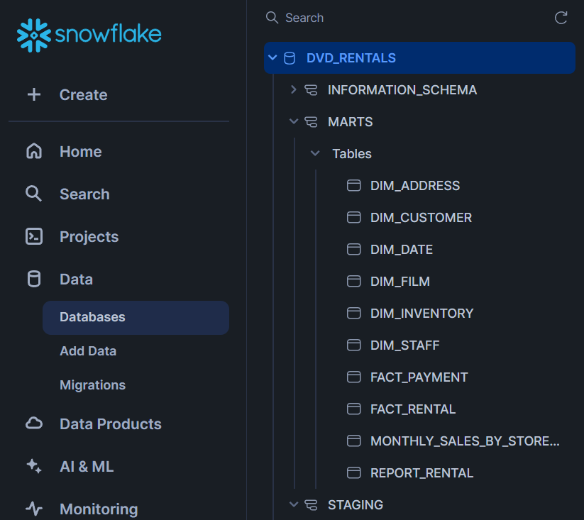
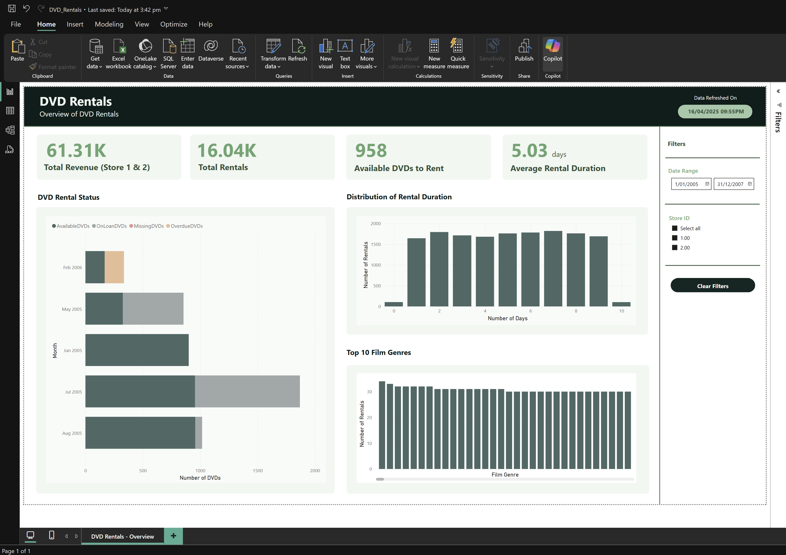

# Project Overview 
This is an ETL pipeline using the DVD Rental Database. The DVD Rental Database begins in normalised form before being denormalised, using fact and dimension tables, for the purpose of analytics.

## Requirements
- PostgreSQL
- pgAdmin
- Airbyte
- Snowflake
- Docker
- dbt

## My Implementation

### PostgreSQL and pgAdmin
The PostgreSQL server for this project is set up via AWS's RDS. Once this has been done, pgAdmin is used to connect to the PostgreSQL server and the `dvd_rental.tar` is used to restore the DVD Rental database on the server.

### Airbyte
Airbyte Cloud orchestrates the ingestion of data from the source PostgreSQL database to Snowlake. Change Data Capture (CDC) is employed on all tables to allow for an incremental update of the source database.

### Snowflake
Snowflake is configured with a "DVD_RENTALS" database, which houses two schemas: "STAGING" and "MARTS". The source database is initially loaded into "STAGING".

### Docker and dbt
For ease of deployment, dbt is run via a Docker container. In my case, I am running dbt with AWS EC2, ECR and ECS. With the help of dbt, the "STAGING" tables in Snowflake are transformed into fact and dimension tables in "MARTS". dbt is used to run a number of data tests via the `.yml` files located in the models folder. dbt also employs an incremental load for all tables in "MARTS". 

- **ECR** to store the Docker image.
    
- **ECS** to run the Docker image. This uses an **EC2** instance as the infrastructure.
    
- **S3** to store a `.env` file containing environment variables.

### Entity Relationship Diagram

## Serving Data
My Snowflake instance was connected to Power BI, where I made a dashboard showing metrics and charts. The tables in my marts schema are what powered this - mainly the one big table.

## How I would improve this project
- More tests with dbt
- Logging to S3 or RDS
- Slowly Changing Dimension Type 2 (just didn't get time)
- More documentation within my SQL queries.
- Better structure of my github project with more documentation around Airbyte, Snowflake and Docker set up.
- More broadly, I didn't have enough time to implement it how I'd like to, so there were parts of the marking rubric I had to skip.
