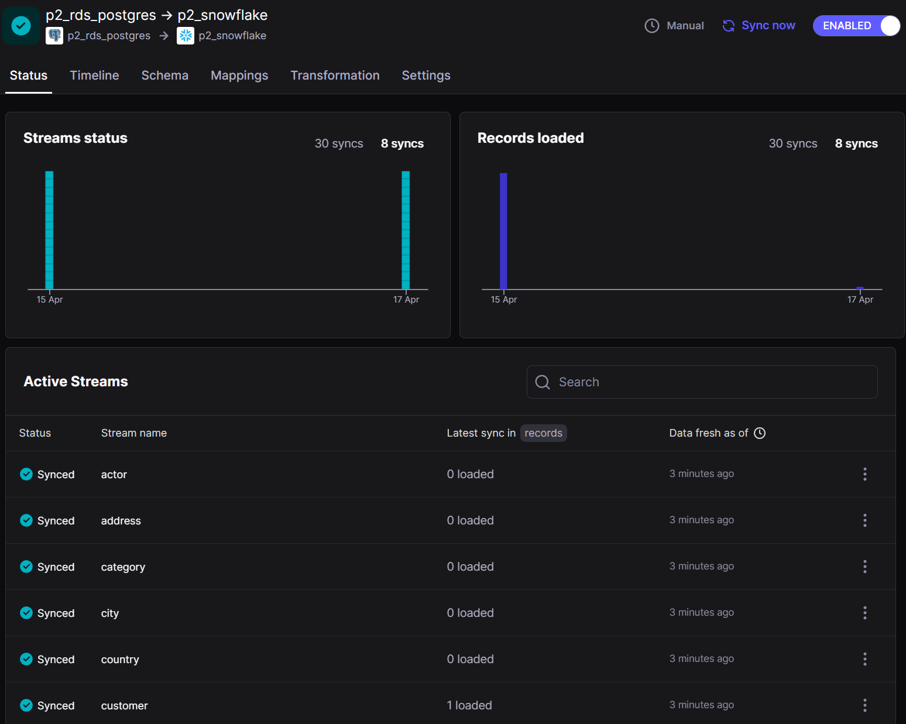
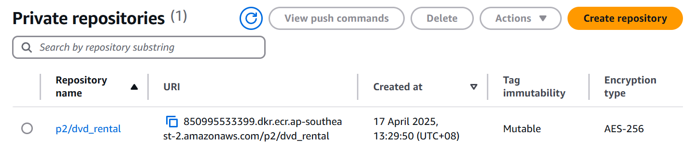
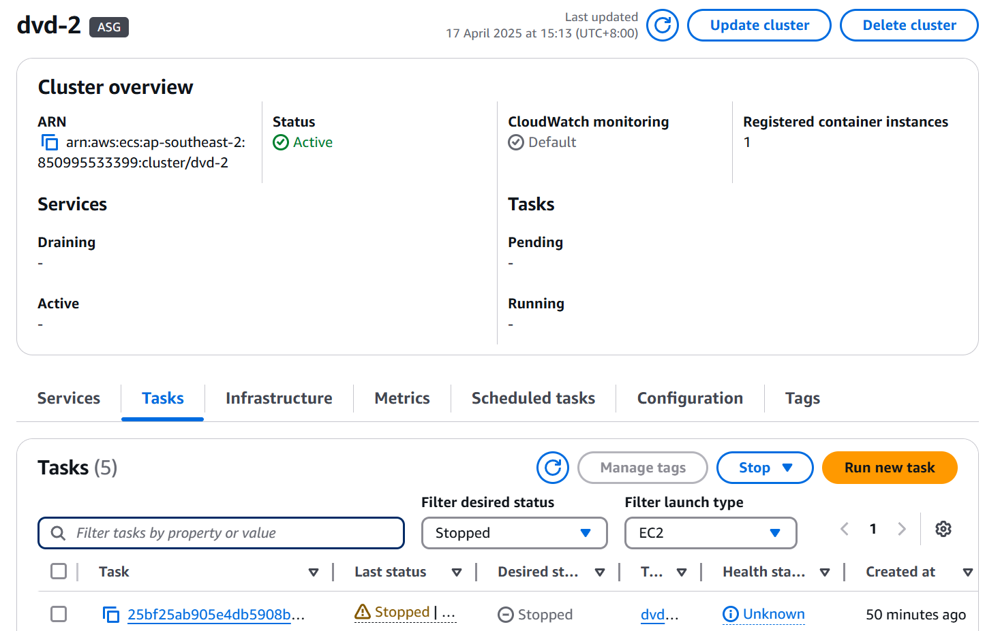
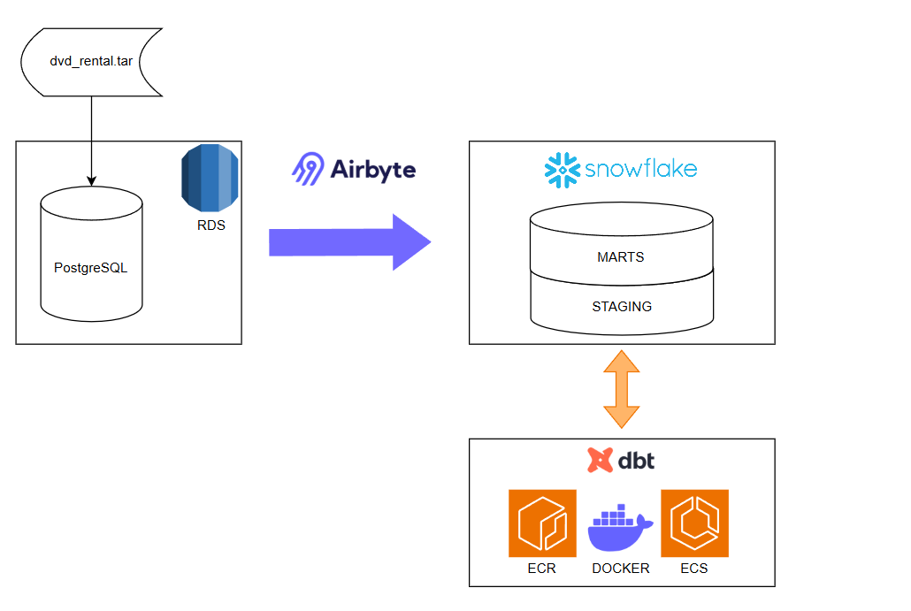

# Project Overview 
This is an ETL pipeline using the DVD Rental Database. The DVD Rental Database begins in normalised form before being denormalised, using fact and dimension tables, for the purpose of analytics.

## Requirements
- PostgreSQL
- pgAdmin
- Airbyte
- Snowflake
- Docker

## My Implementation

### PostgreSQL and pgAdmin
The PostgreSQL server for this project is set up via AWS's RDS. Once this has been done, pgAdmin is used to connect to the PostgreSQL server and the `dvd_rental.tar` is used to restore the DVD Rental database on the server.

### Airbyte
Airbyte Cloud orchestrates the ingestion of data from the source PostgreSQL database to Snowlake. Change Data Capture (CDC) is employed on all tables to allow for an incremental update of the source database.

### Snowflake
Snowflake is configured with a "DVD_RENTALS" database, which houses three schemas: "STAGING", "TRANSFORMATION" and "PRESENATION". The source database is initially loaded into "STAGING".

### Docker
For ease of deployment, dbt is run via a Docker container. dbt interfaces with the Snowflake database to generate fact and dimension tables throughout the 

## Solution architecture
The default implementation of this project is a Docker image deployed to Amazon Web Services (AWS).

- **Squiggle API** for game data and odds data.
- **Docker image** containing python code and the *player fantasy data* CSV.
- **ECR** to store the Docker image.

    
- **ECS** to run the Docker image. This uses an **EC2** instance as the infrastructure.
    
- **S3** to store a `.env` file containing environment variables.

    
- **RDS** to run a PostgreSQL database instance.

    
    

### Architecture Diagram

### Entity Relationship Diagram

## How I would improve this project
- More tests with dbt
- Logging to S3 or RDS
- Slowly Changing Dimension Type 2 (just didn't get time)
- More documentation within my SQL queries
